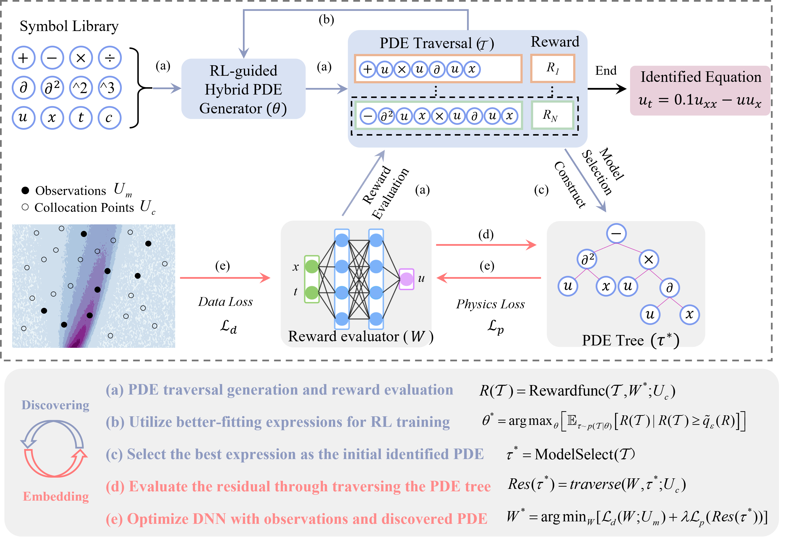

# DISCOVER: Deep identification of symbolically concise open-form PDEs via enhanced reinforcement-learning
The working mechanisms of complex natural systems tend to abide by concise and profound partial differential equations (PDEs). Methods that directly mine equations from data are called PDE discovery. In this respository, an enhanced deep reinforcement-learning framework is built to uncover symbolically concise
open-form PDEs with little prior knowledge. 


This repository provides the code and data for following research papers:

(1) DISCOVER: Deep identification of symbolically concise open-form PDEs via enhanced reinforcement-learning. [PDF](https://journals.aps.org/prresearch/abstract/10.1103/PhysRevResearch.6.013182)

(2) Physics-constrained robust learning of open-formPDEsfrom limited and noisy data. [PDF](https://pubs.aip.org/aip/pof/article-abstract/36/5/057123/3292510/Physics-constrained-robust-learning-of-open-form)


# Framework
 

# Installation
```
conda create -n env_name python=3.7 # Create a Python 3 virtual environment with conda.
source activate env_name # Activate the virtual environment
```
From the root directory, 
```
pip install --upgrade setuptools pip
export CFLAGS="-I $(python -c "import numpy; print(numpy.get_include())") $CFLAGS" # Needed on Mac to prevent fatal error: 'numpy/arrayobject.h' file not found
pip install -e ./dso # Install  package and core dependencies

```
Extra dependencies,
```
pip install -r requirements.txt # Possible incompatibility may occurs due to the version of tensorboard. Manually installing it may be required.
pip install tensorboard 
```

# Mode
There are two executation modes in DISCOVER for dealing with different applications. 
## Mode 1
The first mode is designed for discoving PDEs from high-quality data. Partial derivatives are evaluated by numerical differentiation on regular grids. DNN can be optionally utilized to smoothe available data and generate meta data to reduce the impact of noise. The introduction of the whole framework can be found in the first paper [PDF](https://journals.aps.org/prresearch/abstract/10.1103/PhysRevResearch.6.013182). GPU is not necessary since the matrix calculation is based on Numpy.

## Mode2
The second mode originates from a robust verison of DISCOVER, named R_DISCOVER, which is designed to handle sparse and noisy data.  A NN is utilized to fit the system response and evaluate the reward by automatic differentiation. It is trained in a PINN manner when effective physical information are discovered. This mode is more suitable for the high-noisy scenarios. The introduction of the whole framework can be found in the second paper [PDF](https://arxiv.org/ftp/arxiv/papers/2309/2309.07672.pdf). GPU resources are required to acclerate the searching process.

# Quick start
Please refer to quick_start.ipynb for a quick start (to be updated).

# Run
 For the first mode, several benchmark datasets are provided, including Chafee-Infante equation, KdV equations and PDE_divide, etc. Run the script below can repeat the results in the first paper.
 ```
 sh ./script_test/MODE1_test.sh
 ```
For the second mode, Burgers equation is taken as an example. More examples will be supplemented in the future.
```
sh  ./script_test/MODE2_test.sh
```

# Code Structure
**aggregate.py**: Further generate diverse PDE expressions by GA and dynamic subtree bank.The initial PDE expressions are from the high-quality samples generated by the agent.

**attention.py**: Monotonic attetnion implementation in the LSTM agent.

**const.py**: Optimizer for dealing with const tokens (DSO).

**controller.py**: Forward and backward process of LSTM Agent.

**core_pde.py**:  Deep symbolic optimization model for PDE discovery, including model hyperparameters and construction of basic components.

**execute.py**: Evaluate PDE traversal through predefined operators and operands. Automatic differentiation could be utilized.

**functions.py**: Define the basic operators and operands.

**ga_utils.py**: Supplementary code for ga and dsb.

**library.py**: Collections of tokens.

**prior.py**: Conduct constraints on the logits output by the agent.

**program**: The executable program representing the symbolic expression. Each expression is represented by a program.

**train.py**: procedures of learning.

**stridge.py**: Construct and split tree; Restrictions applied; Evaluate function terms; and Coefficients calculation.

**PDETask (PDEPINNTask)**: Data provided and evaluate necessary properties( reward, cv, mse) 


# Procedures for discovering a new dataset

* **Step 1**:  Put the dataset in the specified directory and write the data loading module. The default directory for benchmark datasets is './dso/dso/task/pde/data_new'. The function of load_data for loading benchmark datasets is located at './dso/dso/task/pde/data_load.py'.

```python
def load_data(data_path='./dso/task/pde/data_new/Kdv.mat'):
    """ load dataset in class PDETask"""    
    data = scio.loadmat(data_path)
    u=data.get("uu")
    n,m=u.shape
    x=np.squeeze(data.get("x")).reshape(-1,1)
    t=np.squeeze(data.get("tt").reshape(-1,1))
    n,m = u.shape #512, 201
    dt = t[1]-t[0]
    dx = x[1]-x[0]
    # true right-hand-side expressions
    sym_true = 'add,mul,u1,diff,u1,x1,diff3,u1,x1'

    n_input_var = 1 # space dismension
    n_state_var = 1 # number of the state variable 
    X=[] # define the space vector list, inlcuding x,y,...
    test_list =None

    ut = np.zeros((n, m)) # define the left-hand-side of the PDE
    dt = t[1]-t[0]
    X.append(x)
    
    for idx in range(n):
        ut[idx, :] = FiniteDiff(u[idx, :], dt)
    
    return [u],X,t,ut,sym_true, n_input_var,test_list,n_state_var
```

* **Step 2**: Hyperparameter setting. All of hyperparameters are passed to the class DeepSymbolicOptimizer_PDE through a JSON file. The default parameter setting is located at './dso/dso/config/config_pde.json'. Users can define their parameters according to the example in the benchmark dataset './dso/dso/config/MODE1'.

* **Step 3**: Execute the PDE discovery task. Output and save results. An example is shown in './dso/test_pde.py'.
```python
from dso import DeepSymbolicOptimizer_PDE
import pickle 

data_name = 'KdV'
config_file_path = "./dso/config/MODE1/config_pde_KdV.json"
# build model by passing the path of user-defined config file. 
model = DeepSymbolicOptimizer_PDE(config_file_path)
    
# model training
result = model.train()

#save results
with open(f'{data_name}.pkl', 'wb') as f:
    pickle.dump(result, f)
        
```

# Reference

(1) Petersen et al. 2021 Deep symbolic regression: Recovering mathematical expressions from data via risk-seeking policy gradients. ICLR 2021.  [Paper](https://openreview.net/forum?id=m5Qsh0kBQG)

(2) Mundhenk, T., Landajuela, M., Glatt, R., Santiago, C. P., & Petersen, B. K. (2021). Symbolic Regression via Deep Reinforcement Learning Enhanced Genetic Programming Seeding. Advances in Neural Information Processing Systems, 34, 24912-24923.  [Paper](https://proceedings.neurips.cc/paper/2021/file/d073bb8d0c47f317dd39de9c9f004e9d-Paper.pdf)

(3) https://github.com/dso-org/deep-symbolic-optimization